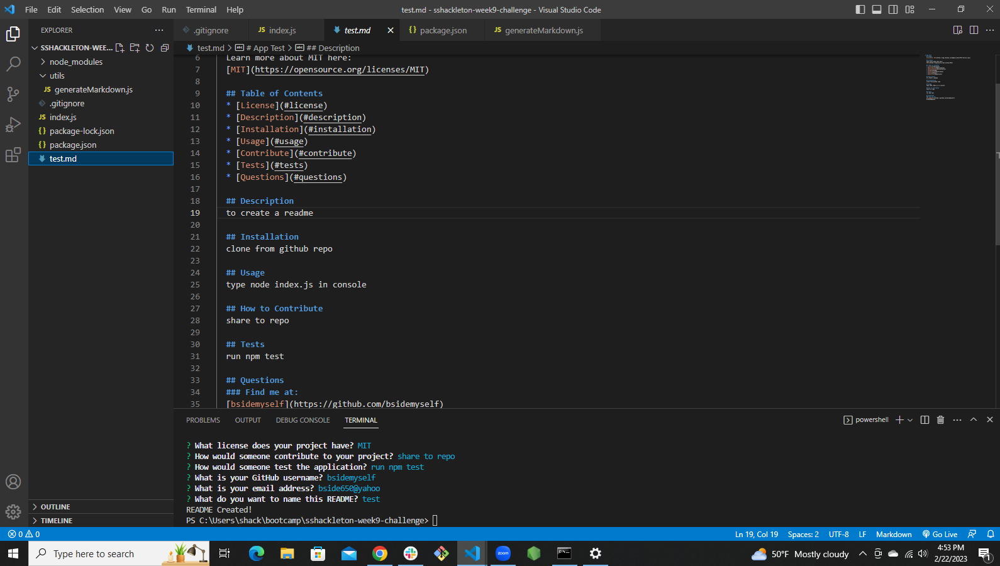

# Week 9 Challenge - README Generator
## Description
This is a JavaScript tool using node.js that users can run to generate a detailed Readme for their projects.
## User Story
* AS a web developer
* I WANT a node.js app
* SO THAT I can quickly create a professional Readme file for my project.
## Usage
A user of this app will be asked a series of questions about the project they're working on, then the app will create a new Readme file with their answers.
## Installation & Instructions
Clone the repo to your computer, open the internal terminal in VS Code and run "node index.js"
## Screenshot

## Demo Video Link
https://drive.google.com/file/d/15ckgaaafqTxcpONFIXCQY6OkN6qVi8lx/view
## Resources Used
* Node.js
* NPM
* Inquirer
* FS to write new/to file
